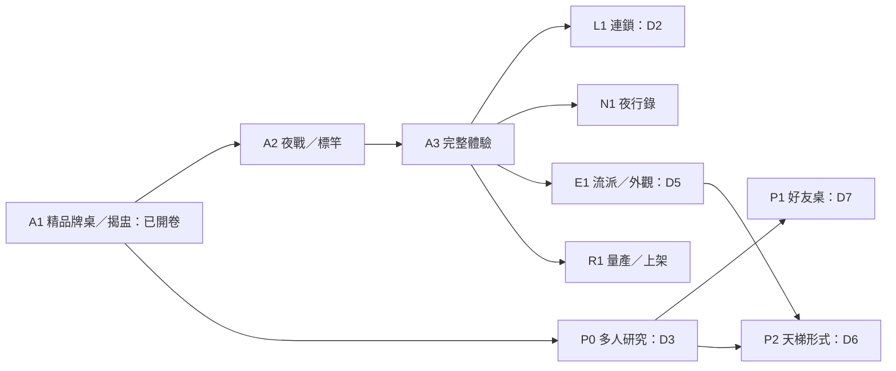

# 妖市總藍圖：廟埕暗桌・紙紮顯靈

更新：2026-09-15｜開卷產品基準：`eafec13 / v0.57.10`

**本檔是產品範圍、製作優先序與開卷狀態的統一入口。** 規則仍以 GAME_DESIGN、架構以 ARCH_SPEC、美術以 ART_BIBLE、驗收以各卷有效凍結檔為準。本檔不以摘要取代那些契約。

## 0. 最新裁定與閱讀方式

- **最新已裁並實作：取消正式戰力、六種詛咒各自效果與實物造型**。v0.57.12 已隨 `b3ea547` 公開並核對送達；85 項測試、300 詛咒幾何、201 手機詛咒與 768 卡面案例通過，見 [本卷報告](experiments/2026-09-15-curse-migration/README.md)。原 A1 效能／真機未過項保留。

使用者：「合併一起整理成總藍圖，然後按照 A 方向開卷。」

- 已批准：合併 Antigravity 舊藍圖與 Astra 檢視；美術方向採 **A 廟埕暗桌・紙紮顯靈**；立即開 **A1 精品牌桌與揭盅**，排在新連鎖／幽靈功能前面。
- A1 已實作共同取景、自動退鏡、頁籤與 3D 焦點同步及漆木／紙色介面；55 測試、1599 幾何案例通過。v0.57.11 已公開供試玩（aa7aa7b）；相對性能仍 RED，真機與 A1 最終驗收保留。
- A1 開卷文件：[執行計畫](../plans/2026-09-15-a1-premium-table.md)、[驗收凍結檔](experiments/2026-09-15-acceptance-a1-premium-table.md)、[基線與進度](experiments/2026-09-15-a1-opening/README.md)。
- D2／D3／D5 等原本的規則與產品決策仍待裁；「收進總藍圖」不等於批准其中的數值、配方、商業模式或網路方案。
- A2 以後保留完整路線，具體開卷仍依前置與各 D 決策。沒有任何舊功能因未優先排入 A1 而被默默取消。
- 玩家已回報 v0.57.10 整局通關，可以下一步。原 P4、M-A1、效能與手機逐項驗收各自保留，不由「通關」代替。
- **2026-09-17 使用者裁定「按照建議」（九題，見 [交接信](handoffs/2026-09-15-a1-premium-table.md) 末節）**：①M-A1 三尊簽字——殘日簽字收現況、大士爺舌／龕簽為引擎限制且護心鏡回修排進 A2、有應公簽為 haunt 體型取樣限制（乙）；②P4 記「10/18、8 支已知未過」進 A1 未解清單，根因回修併入 A2；③128 枚 gate 口徑定為逐輪（paired 5/5），中位口徑退場；④矩陣工具跑序依賴排維護小修、不阻塞 A1 結案；⑤開「A1 結案卷」逐條走凍結檔 G0–G8 宣告 A1 完成並列未解項；⑥**開 A2**，標竿＝拼板舟（祖靈）／福壽綿長（香火）／魔神仔紅帽（陰氣）／大士爺（傳說）／詛咒一件開卷時挑；⑦D2 連鎖延後至 A3 後再開題（預設案 3 組、配方公開）；⑧D3 幽靈延後至 A3 後，P0 反例研究到時再開；⑨**D5 已裁**：競技全開，熟練度只解鎖外觀與列傳內容、不解鎖使用權，經濟與持久化留 E1。A1 效能診斷五卷（0.57.13–0.57.17）桌機相對 gate 全過後停追效能。

來源： [舊版 ROADMAP_V2](ROADMAP_V2.md)、[Astra 專業檢視](proposals/2026-09-15-astra-game-blueprint.md)、[舊版架構評審](proposals/2026-09-10-roadmap-v2-review.md)、[09-12 進度與後續裁定](proposals/2026-09-12-roadmap-v2-progress.md)、[v0.57.10 交接](handoffs/2026-09-15-table-stamps.md)。原文保留供追溯；遇到衝突先讀最新明確裁定，不依檔名日期盲選。

### 狀態字典

| 欄位 | 含義 |
|---|---|
| 已實作 | 有產品／程式證據；不表示所有品質閘門通過 |
| 部分 | 有骨架或部分內容，舊案全部效果尚未完成 |
| 未實作 | 仍屬內容／工程候選 |
| 保留 | 繼續放在產品範圍內，沒有取消 |
| 改寫 | 目標保留，但既有假設、規格或呈現需修訂 |
| 延後 | 保留，排在前置里程碑之後 |
| 待裁 | 指定決策未定，不能以本表代替批准 |

## 1. 作品定位與品質支柱

**用自己的命，買別人的報應。** 玩家在深夜妖市用壽命競標法寶，讀對手的意圖，把惡意與風險推回桌上，活到天明。

保留三根原始支柱：深度在拍賣桌；壽命同時是籌碼與生存資源；毒標讓敵意有作者。「自然解決滾雪球」保留為設計目標，不当作無須平衡驗證的事實。

品質要求：

1. **決策可理解**：下標前知道自己的成本、規則與可能收益，不顯示對手私有資訊。
2. **因果可追溯**：看得出哪次競標、哪件法寶、誰的毒標造成結果。
3. **風格有身分**：台灣民俗的器物、紙紮、說話方式與儀式節奏互相呼應。
4. **操作可靠**：手機完整讀卡、可辨印籌歸屬；跳過、切背景、轉向與重入維持正確。
5. **內容可生產**：先完成標準桌與少量標竿，再複製角色、章節、外觀。

暫不承諾工期、成本、營收或市場唯一性。以 A1 的實際美術／工程／驗收成本建立後續估算。

## 2. A 方向的美術與體驗製作規格

### 2.1 場景與介面

近景是舊神案與手邊命籌，中景是紅布托盤與當前拍品，後景是冷暗的廟口、攤棚與人影。暖主光抓住拍品；桌外提供氣氛，避免全場一樣亮。用材質、輪廓與留白建立質感，不靠大量 bloom 與細碎亮線。

UI 繼續以 DOM 提供可讀文字與可靠觸控。介面朝漆木、墨色、舊紙、硃紅、少量金色整合；陣營辨識色仍遵守 ART_BIBLE。已選的低矮橫屏「名稱切換＋完整單卡」保留；大屏保留四卡。A1 用現有模型驗構圖，角色重製在 A2。

### 2.2 模型、動態與聲音

- 三系保留：香火寬正、硃紅鎏金、儀仗節奏；祖靈修長垂直、土褐靛藍、靜止後瞬發；陰氣不對稱、苔綠濕黑、錯拍。詛咒是人造的惡意之物。
- 不可愛、真實參照、幾何＋頂點色等既有規範繼續有效。每件新模型先看 2–3 張實物參照，抽出 3–5 條辨識特徵。
- A2 做三系各一件、詛咒一件、傳說一尊的標竿，分英雄視角、實際桌面大小、滿編三種使用情境檢查。
- 器物→顯靈→紙紮化身是一項待原型驗證的內容方向，不在 A1 偷換全部法寶模型。
- 普通效果克制，重要結果集中；聽得出落籌、封標、揭盅、受咒的差別。新聲音先聆聽驗收，再談語音包量產。
- 既有 ACES／sRGB／霧／補光／bloom 不算新增成果。陰影、環境反射與新貼圖管線須依既有規範及實機成本另裁，A 方向本身不解除禁止。

### 2.3 一夜的體驗鏈

看貨（哪件值得命）→盯上（他在嚇誰）→下標（我願付幾年）→揭盅（誰看穿誰）→夜戰（法寶如何兌現）→天明（下夜如何改）。

每階段有一個主問題與主動作；其他資訊保留查閱，不為美術直接刪字。演出可跳過而不改結算，縮時與原速證據分開。

## 3. 舊版七章逐項承接清單

每列 ID 是後續卷／提交可引用的範圍鍵。以下例子的具體數值若未裁，一律保留為「原案」，不是新凍結值。Top 3 重複項在 §3.7 對應同一 ID，避免重複開發。

### 3.1 核心玩法與九大系統（舊 §1）

| ID | 原案內容與現況訂正 | 實作／處置 | 去向 |
|---|---|---|---|
| C01 | 壽命暗標、買路錢、保守／押命標、毒標勒索、盯上宣告、4筆加權信譽 | 已實作；保留規則，提升呈現；經濟仍要驗證 | A1、A3 |
| C02 | 12夜：耳語、盯上、請神、封標、揭盅、三拍夜戰、天明；原請神順序是概括，現為燒香封入與指定夜結算 | 已實作；依現行流程，不照原文字重排 | A1–A3 |
| C03 | 原列10角色：青面攤主、紅衣婆婆、斷手書生、獵人、收驚婆、孝女白琴、閭山法師、大家樂組頭、陰間當鋪、普渡爐主；專屬被動與 AI | 已有角色系統；原列表不是本版 selectable/schema 數量保證，按 ROLES 與 UI 名單盤點 | A2、N1 |
| C04 | 原列27法寶、三系共鳴、6件壽命↔戰力命格與獻祭刀 | 已有資料／引擎；POOL 與 ABILITIES 是不同分母，不把27當能力表筆數 | A2、L1 |
| C05 | 24心願與 canDraw 防恆假 | 已實作；保留，完整說明不可被美術裁掉 | A1、A3 |
| C06 | 3夜規：落魄夜、收祟夜、押寶夜 | 已實作；保留，測試維持現行語意 | A1、A3 |
| C07 | 8異事：瘟王過境、試膽大會、厲鬼索命、送肉粽、觀落陰、大風吹、陰間放貸、博杯 | 已有系統；保留；「全通過」需引用各卷既有測試，不能跨版本泛稱 | A3、P0 |
| C08 | 殘日、大士爺、有應公請神；原案「天井保底／階梯餽贈」已過時 | 現行香火池3.0、5/8/11夜、一人一尊；不恢復已移除機制；局末結清既有待裁註記保留 | A2、P0 |
| C09 | Three.js、GLB、三拍、共鳴、燃燒溶解、Hitstop；原「33尊」為歷史描述 | 已實作骨架；模型數需按資產表盤點，辨識與滿編品質部分未過 | A2 |
| C10 | Web Audio 合成打擊／銅鑼＋四首主題 BGM | 已有聲音系統；「零音檔」不當現況承諾，BGM/素材現況於聲音卷盤點 | A3、E1 |

### 3.2 公平、熟練度、妖幣與五類外觀（舊 §2）

| ID | 完整承接內容 | 實作／處置 | 去向 |
|---|---|---|---|
| E01 | 角色／法寶初始全開，不賣數值優勢 | 保留原公平方向；新流派是否全開另依 D5 | E1 |
| E02 | 熟練度／成就累積，解鎖備選被動，開局3選1，不堆疊 | 未實作；延後／待D5；建議熟練度優先外觀，流派選擇權全開 | E1 |
| E03 | 紅衣婆婆原案A「記仇奪標」：被毒時下手者−2、自己+2；搶仇人主系法寶有效價+3 | 原流派候選完整保留；非本版平衡裁定 | E1／D5 |
| E04 | 原案B「厲鬼引路」Lv3：有人壽命≤15，毒標費用−2 | 同上，不以side-grade名稱保證公平 | E1／D5 |
| E05 | 原案C「血衣反噬」Lv5：戰敗時令勝方多失去其詛咒品件數的壽命 | 同上；須界定資訊、時點與連動 | E1／D5 |
| E06 | 妖幣依存活夜數、心願與名次取得 | 未實作；保留候選，先統一局末排名與版本化個人檔案 | E1 |
| E07 | 妖幣扭蛋／100%外觀獎池 | 未實作；延後、商業模式待裁；保留原案，不自動改為付費抽卡 | E1 |
| E08 | 台語／閩南語語音：白琴哭喪、組頭報明牌、法師咒訣 | 未實作外觀商品；保留，聲音標竿先於量產 | A3→E1 |
| E09 | VFX皮：幽綠冷火／純黑煞炎／純白淨火，火星換落符／濺血／銅錢，碳化灰燼 | 未實作皮膚系統；保留；皮膚不得破壞陣營／受擊辨識 | E1 |
| E10 | 桌皮：老檜木、八卦黃絹、停屍石板；燈籠皮 | 基礎環境部分已有，換皮系統未做；保留 | A1→E1 |
| E11 | 盯印皮：硃砂血玉、青銅饕餮、生鏽引魂鈴 | 基礎印籌已做，外觀系統未做；保留平放与歸屬標準 | E1 |
| E12 | 信物皮：白米香爐、算盤當票、白骨骰子等 | 基礎席位信物已有，個人化選配未做；保留 | A1→E1 |

### 3.3 連鎖、高光、三級演出與指定大招（舊 §3）

| ID | 完整承接內容 | 實作／處置 | 去向 |
|---|---|---|---|
| L01 | 跨系連鎖與同系共鳴形成取捨；原首批6組 | 未實作；保留，建議先最多3組，3/6與公開性仍待D2 | L1 |
| L02 | 千眼神算＝祖靈之眼＋千里眼銅鈴；明夜看3件、揭盅看第二高確切價 | 原例保留；新增私有情報／hook契約待裁，不能默認可直接接 onMarketDraw | L1 |
| L03 | 水陸偷渡＝拼板舟＋水鬼浮標；被塞詛咒時銷毀 | 原例保留；處理觸發／銷毀／轉移／重複效果與反制 | L1 |
| L04 | 雙虎滅煞＝虎爺印＋虎姑婆指甲；金斑黑虎大將軍、橫掃與撕甲 | 原例保留；合體替換、部隊預覽與新模型各需驗證 | L1 |
| L05 | 市集可連鎖拍品的符文金光引線與名稱提示 | 未實作；保留；UI和AI讀同一組合查詢 | L1 |
| F01 | 誅心：嚇退後低價得手，黑白水墨特寫、鼓、得手字樣 | 三種高光之一已實作且有命中圖；原聲畫細節僅部分落地 | A3 |
| F02 | 借刀：毒標斃命，受害者特寫、黑紫火／封胸、招魂鐘與因果字樣 | 同上；觸發以真實已結算事件為準 | A3 |
| F03 | 連鎖破陣：首次連鎖，雙法寶浮空碰合、法陣 | 未實作；保留，受D2/L1前置限制 | L1 |
| F04 | 命懸一線：壽命≤5逆轉勝，心跳、血暗角、金符破曉 | 已有低血存活冠軍轉場與存活修正；原全套声畫部分，名稱/精確條件依現行規格 | A3 |
| F05 | Tier1 原200–300ms快招，27專屬動作，8v8基礎戰≤5秒 | 專屬短招與每拍短推已做；現行時長依有效凍結，不重新套原數字；整體品質未全過 | A2 |
| F06 | Tier2 原500ms減員、Hitstop、破鑼、溶解 | 有燃燒／命中骨架；碎裂管線見 [對決VFX規範](design/2026-09-16-duel-vfx-pipeline-spec.md)；不把500ms當新時間表 | A2 |
| F07 | Tier3 原1.2–1.5秒、壓暗黑邊、低角度、全屏大招 | CINEMA與三尊效果部分已有；letterbox沿革／安全區依原裁定，不能單憑總藍圖加回 | A2 |
| F08 | 大士爺：青面獠牙巨影從天頂壓掌，烈火焚天 | 三尊演出已有，原指定資產與鏡頭未逐條完成；保留內容目標 | A2 |
| F09 | 有應公：裂地深淵、枯骨冥幣拖走後排 | 同上；M-A1三輪未過不得重置，先處理原裁定 | A2 |
| F10 | 殘日：金烏破曉光矢穿雲貫穿前鋒 | 同上；先保來源、對象和本體可讀 | A2 |
| F11 | 雙虎：黑金雙虎騰空合體、重擊震屏 | 未實作；保留，須配合reduced與D2 | L1 |

### 3.4 夜行錄、休閒與天梯（舊 §4）

| ID | 完整承接內容 | 實作／處置 | 去向 |
|---|---|---|---|
| N01 | 夜行錄／角色列傳兼任新手教學、世界觀、練習、熟練度與妖幣來源 | 未實作章節系統；保留；教學與經濟分依賴 | N1 |
| N02 | 首3章：破廟逢青面→招魂嶺收驚婆→荒塚紅衣婆婆；長線10角色 | 保留；原「挑戰解鎖角色」與全開競技有衝突，章節／角色使用權須D5分清 | N1 |
| N03 | 每章開場引言、專屬恩怨台詞、通關志怪殘卷／台語劇本 | 保留；可先用A3台詞標竿；文化參照照ART_BIBLE | A3→N1 |
| N04 | 休閒自由桌：試連鎖、每日心願、好友同樂、無段位壓力 | 未實作線上模式；保留；「每日」是新局外機制待裁，不等於局內今夜心願 | P1、E1 |
| N05 | 排位：原前兩名加分、後兩名扣分 | 未實作；保留候選；共用局末排名，棄局／平分／補位規格另裁 | P2／D6 |
| N06 | 段位：生人→引路客→通幽使→開壇法師→陰陽掌櫃→夜巡城隍／妖市判官 | 完整保留命名候選，最高階兩個名字尚未二選一 | P2 |
| N07 | 賽季：開壇法師以上拿專屬皮、判官玉印、頭像框 | 未實作；保留原門檻候選，待賽季／排名／外觀契約 | P2、E1 |

### 3.5 幽靈、payload、好友房與即時匹配（舊 §5）

| ID | 完整承接內容 | 實作／處置 | 去向 |
|---|---|---|---|
| P01 | 幽靈→好友房→即時天梯的原三階段路線；標題曾稱兩階段 | 改寫依賴：幽靈不保證是即時對戰必要地基；保留三種產品形式 | P0→P1→P2 |
| P02 | Ghost payload 約30KB：roleId、rankTier、逐夜night/mark/bids(item,amt,type,intent)/incense/bag | 原欄位全部保留為草案；未實作。補seed、規則版本、座位、所有選擇／時點／合法性；私有bag不得直接群發 | P0／D3 |
| P03 | Supabase／Cloudflare Workers REST、Serverless與蒐集博弈資料，後來提Worker＋KV／D1 | 候選保留，未選後端；「零成本／幾乎零月費」不當保證，選型時按容量與用量驗；蒐集資料先定同意與最少欄位 | P0 |
| P04 | 同段位取3名真實歷史殘影；原0.1秒取回／零等待 | 目標保留、數字未驗證；原回放vs行為AI須誠實標示；同種子桶分岔先驗 | P0／D3 |
| P05 | 6位房間碼、4人WebSocket、重連同步 | 未實作；保留；伺服器權威輸入／私有狀態投影先定 | P1 |
| P06 | 4人圍桌語音、即時表情 | 未實作；保留／延後，語音是獨立傳輸與權限成本，不算WebSocket附贈功能 | P1後段 |
| P07 | 全球即時匹配，20秒出價節奏 | 未實作；原時間候選保留，與每相位、供奉送神決策D7一起定 | P2 |
| P08 | 排隊超15秒補幽靈，對局逾時自動補位Ghost Fallback | 未實作；保留兩種情境，明定AI/幽靈標示、排名公平與逾時裁決，不承諾無縫 | P1→P2 |

### 3.6 紙紮、環境與實體操作（舊 §6）

| ID | 完整承接內容 | 實作／處置 | 去向 |
|---|---|---|---|
| V01 | 民俗微縮怪誕、竹篾紙骨、剪紙金邊折痕、黑白灰燼 | 已有部分風格與效果；延續並統一為A方向，非改走寫實大世界 | A1、A2 |
| V02 | 深紅老檜木桌、漆面微反光、斑駁木紋 | 幾何／頂點色木紋與桌面已有；保留並精修，材質新管線須另裁 | A1 |
| V03 | 燈籠PCF軟陰影、晃動拉長鬼影 | 未開shadow；保留／延後，ART_BIBLE要求先有iPhone fps，不以選A解除 | A2後環境研究／D8 |
| V04 | 香灰、泛黃硃砂符咒殘卷 | 已實作基础；保留，避免用細節增加遮擋與draw calls | A1 |
| V05 | 桌心紅布GLB拍品陳列、詛咒紫黑火；原4–5件為玩法概括 | 目前4槽骨架已有；保留，不由總藍圖擅增第5槽 | A1 |
| V06 | #felt挖空、卡片退側、底部出價、pointer-events與Raycaster | 已實作；保留，A1整合HUD與鏡頭安全區，不能退回表格中心遮桌 | A1 |
| V07 | hover浮空、微旋、靈光、鏡頭微推；觸控點選 | 已實作基础；保留同一槽位語意與觸控可靠性 | A1 |
| V08 | 下標3D銅錢／木籌推入，代表壽命 | 已有128枚上限籌碼系統；保留，與自己預算同步 | A1 |
| V09 | 盯字血玉令牌拍桌、木撞聲 | 已由v0.57.10改平放印籌＋木籌槽；保留實體性，原立牌不再是目標 | A1 |
| V10 | 桌角香爐／算盤／組頭明牌等，對手在場感 | 已有席位信物基础；A1保留；新身份美術與皮膚分A2/E1 | A1、A2、E1 |

### 3.7 舊 Top 3 不重複立項（舊 §7）

| 原優先項 | 唯一承接ID | 新排法 |
|---|---|---|
| Top1：DOM掏空→托盤→Raycaster／盯印 | V05–V09 | 已有基础，A1品質收斂，不當從零功能 |
| Top2-1：27普通招提速 | F05–F07 | 已做短招，A2因果／辨識收尾 |
| Top2-2：首批6鏈＋引線 | L01–L05 | L1、D2先裁；原6組目標保留，先3組是建議 |
| Top2-3：三尊、連鎖大招與45度低角／letterbox | F07–F11 | A2／L1；原45度不覆蓋現行CINEMA機位 |
| Top3-1：幽靈端點／即開 | P01–P04 | P0反例與契約先行 |
| Top3-2：前三章／熟練度 | N01–N03、E02 | N1與D5依賴分開 |
| Top3-3：妖幣、語音包、桌布抽卡 | E06–E10 | E1；等核心體驗與持久化契約 |

## 4. Astra 新增內容逐項歸位

| ID | 新內容 | 處置／去向 |
|---|---|---|
| A01 | 整理HUD／模型共同構圖、飛行模型碰頂、卡片與印籌歸屬 | 已授權 A1 |
| A02 | 同景A風格標準、頭像／字體／材質一致性 | A1做牌桌UI；角色頭像量產在A2 |
| A03 | 來源→對象→結果的夜戰層級與滿編可讀性 | A2，保留原P4歷史，不重置失敗 |
| A04 | 因果帳本：依實際公開事件生成局後恩怨摘要 | A3候選，禁止虛構或洩漏私有資訊 |
| A05 | 器物顯靈原型 | A2候選，一件先驗，不混進A1 |
| A06 | 對手依公開事件回話，建立記性／人格 | A3純台詞候選；改AI或跨局記憶另裁 |
| A07 | 完整12夜精品切片、初見玩家理解與再玩動機研究 | A3，門檻與樣本開卷時凍結 |
| A08 | 三系、詛咒、傳說標竿與多尺度資產管線 | A2，依美術聖經与原失敗裁定 |
| A09 | 同種子改得標結果的分岔反例 | P0，未驗證推論先列研究，不當已證實bug |
| A10 | 伺服器真實狀態、每人可見投影、輸入版本、合法性、重連快照 | P0/P1架構前置；決定性不等於保密 |
| A11 | 移除「幽靈必然是即時地基」的未證假設，兩個可停止原型 | P0提案，D3裁定後定正式網路路線 |
| A12 | 平台長局效能、恢復流程、語言、文化與資產来源、發行包 | R1；手機／桌機不同證據，不互代 |
| A13 | 規範漂移追溯：光照數值、請神歷史描述、局末結清待裁 | A1先記現在值與原規格；規則衝突歸原決策，不順手修改 |

## 5. 製作路線與前置

| 卷 | 交付成果 | 前置與退出條件 | 狀態 |
|---|---|---|---|
| **A1 精品牌桌與揭盅** | 共同構圖、A美術語言、完整卡、盯印歸屬、揭盅路徑與操作 | 現有規則不變；本卷凍結檔、真機／公開送達分階段驗證 | **完成（2026-09-17，v0.57.17；[結案卷](experiments/2026-09-17-a1-closeout/README.md)）**：桌機相對 gate 連四卷 GREEN、玩家真機通過；未解五條列於結案卷（P4 8 支、M-A1 已簽字、G7 目視部分、真機 fps 未量、矩陣工具不穩定） |
| A2 紙紮夜戰與資產標竿 | 三系標竿、來源／對象可讀、三尊、安全區（著色器／碎裂見 [對決VFX規範](design/2026-09-16-duel-vfx-pipeline-spec.md)） | A1構圖契約；P4/M-A1既有三輪失敗依原裁定，不能自动重跑洗掉 | **進行中（2026-09-17）**：[計畫](../plans/2026-09-17-a2-benchmarks.md)、[凍結 v0.1](experiments/2026-09-17-acceptance-a2-benchmarks.md)；拼板舟甲案 r3 已簽字（未過：玩具 1/4，v0.57.18）；下一件福壽綿長＋我方單一語彙 |
| A3 完整體驗切片 | 聲音、角色反應、因果帳本、12夜與再玩研究 | A1+A2主要呈現；玩家研究門檻另凍結 | 排程候選 |
| L1 法寶連鎖 | 3或6組、UI引線、AI估值、連鎖破陣 | D2、ARCH_SPEC順序與新情報契約、原六之四/n≥10000 | 待裁 |
| P0 多人研究 | 回放反例、日誌／版本、私有資訊模型、後端比較 | 可在A1後獨立研究；D3前不得宣布選定幽靈產品 | 研究候選 |
| N1 夜行錄 | 首3章→角色列傳、殘卷與挑戰 | A3內容管線；競技角色解鎖衝突依D5 | 延後保留 |
| E1 進度／妖幣／外觀 | profile、skin id、流派、5類外觀與經濟 | D5、localStorage既有凍結與資料相容、商業模式 | 延後待裁 |
| P1 好友／休閒桌 | 4人房、重連、逾時、可選語音表情 | P0與D3/D7；私有資料與權威驗證 | 延後待裁 |
| P2 天梯／賽季 | 匹配、段位、賽季、補位與獎勵 | D6、可信对局、外觀/排名契約；形式依D3，不預設非同步或即時 | 延後待裁 |
| R1 量產／上架 | 裝置與恢復、素材／語言、包裝、發布回退 | A3穩定；依選定產品納入L1/N1/E1/P1/P2 | 後期 |

舊 Astra M0/M1→A1；M2→A2；M3→A3；M4→L1；M5→P0/P1；M6拆為N1/E1/P2/R1。軟陰影等環境研究歸A2後候選，不遺失。

圖中 A1 以外為建議依賴，不表示本輪批准全部開工。若P2選即時形式，P1是必要前置；若選非同步形式，依P0結果另定，不直接套同種子精確重播。

## 6. 待裁決策簿

| 決策 | 狀態／必答內容 |
|---|---|
| D1 桌面範圍 | 已裁整片掏空並已落地；A1保留 |
| D4 舊順序與短招 | 歷史短招裁定保留；本輪明確插入A1品質卷優先，不改既有時長 |
| A方向 | **已裁A**；B戲台、C寫實不再是本卷待選題 |
| D2 連鎖 | 首批3/6、公開時點／配方洩漏、啟動/失效/重複/材料與詛咒交互；兩案未裁。**2026-09-17：延後至 A3 之後再開題，屆時以「3 組、配方公開」為預設案拷問** |
| D3 幽靈 | 回放／行為殘影／即時、分岔處置、匿名身份、版本桶；先反例研究。**2026-09-17：延後至 A3 之後，P0 反例研究到時再開；不預設幽靈是即時對戰的地基** |
| D5 流派與進度 | **已裁（2026-09-17）：競技全開；熟練度只解鎖外觀與列傳內容，不解鎖使用權；經濟／持久化留給 E1** |
| D6 天梯 | 非同步或即時、帳號時機、排名／平手／棄局／獎勵 |
| D7 送神與網路相位 | 保留單機決策入口，網路版需定密封／逾時／補位時點 |
| D8 環境管線 | 已有頂點色／幾何木紋；新貼圖與軟陰影例外仍依規範／實機證據裁定 |
| 原失敗项 | M-A1／P4原三輪與滿編遮擋不因選A重置；本輪不修改原通過門檻。**2026-09-17 簽字：M-A1 三尊依 [blindread-v2](experiments/2026-09-07-legend-art-evidence/blindread-v2.md) 末節簽字（殘日收現況／大士爺舌龕引擎限制、護心鏡回修排 A2／有應公 haunt 體型限制）；P4 記 10/18、8 支已知未過，根因回修併入 A2** |

## 7. 驗收、生產與維護

- 分開報告：功能正確、畫面可讀、美術方向符合、原速節奏、真機效能。截圖／模擬／AI盲讀／Safari真機不能互相替代。
- 已發布基準的40測試、768卡面、256印籌分配保留來源；後續改動需跑各自受影響檢查，不能把舊結果貼成新結果。
- 每卷先有範圍、基準、可失敗的標準、命令、證據路徑，再做程式／資產。Astra定方向與最後視覺驗收，低風險蒐證與機械任務可委派。
- 改規則時不用不適用的歷史trace oracle；純演出改動比對同版基準與完整seed集合。引入連鎖需關閉等價與啟用行为兩側證據。
- 各卷以可回復的小批次實作；數據遷移另有版本／相容策略。品質成立再擴資產，先記工時再估量產。
- 發布沿用持續授權：必要驗證完成即可推正式並確認送達。GitHub CLI目前未登入不改變授權；實際推送時檢查可用git認證，不能因此宣稱已發布或阻擋文件開卷。
- 新功能增加到本表並引用ID；拆分／延後／取消須寫理由與裁定。原凍結門檻不得以文件改名、換fixture、重新開卷繞過。

## 8. 本次整併完成範圍

舊版七章與Top3均有逐項承接，保留所有具名例子與數值候選；Astra新增項也有去向。已完成與未完成分開，原文仍留作設計沿革。

這次批准的是總藍圖整併與A1開卷；A1產品交付完成、D2/D3實作與整個遊戲上市，均不是本次文件完成的同義詞。
