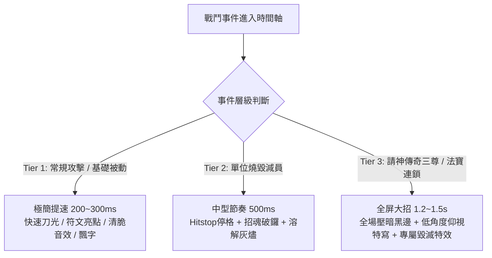
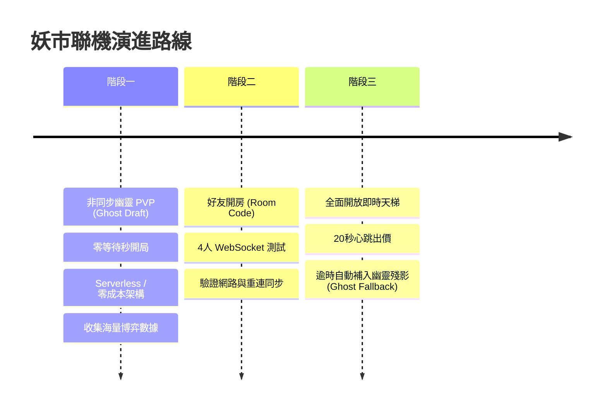

# 《妖市》（Yaoshi）產品全方位演進藍圖與開發優先級（Roadmap）

> **編寫日期**：2026-09-09  
> **專案定位**：台灣民間志怪題材・壽命競標與心理博弈・4人線上策略棋牌  
> **執行管線**：本文件作為後續使用 **Claude Code + Fable 5.1** 迭代落地的核心規格依據。

---

## 目錄
1. [代碼現狀與核心架構客觀解讀](#1-代碼現狀與核心架構客觀解讀)
2. [長線留存與商業閉環：熟練度流派與外觀抽卡](#2-長線留存與商業閉環熟練度流派與外觀抽卡)
3. [多巴胺與戰鬥演化：法寶連鎖與三級視覺分級](#3-多巴胺與戰鬥演化法寶連鎖與三級視覺分級)
4. [遊戲模式與敘事體系：單機夜行錄與天梯排位賽](#4-遊戲模式與敘事體系單機夜行錄與天梯排位賽)
5. [聯機架構演進：非同步幽靈殘影 ➔ 4人即時連線](#5-聯機架構演進非同步幽靈殘影--4人即時連線)
6. [3D 視覺與沉浸感：新中式民俗微縮與拍賣桌實體化](#6-3d-視覺與沉浸感新中式民俗微縮與拍賣桌實體化)
7. [下一步開發優先級（Top 3 落地 Roadmap）](#7-下一步開發優先級top-3-落地-roadmap)

---

## 1. 代碼現狀與核心架構客觀解讀

### 1.1 核心玩法
- **本質**：以「壽命（既是錢包也是血條）」為核心資源、以「拍賣桌上的密封暗標與勒索博弈」為核心決策、以「紙紮夜戰」為自動結算驗收的單局非對稱策略對抗遊戲。
- **三支柱落地**：
  1. *深度在拍賣桌，不在戰場*：喊價與博弈決定成敗，戰鬥只是計分與扣血。
  2. *壽命＝籌碼的自平衡*：搶最強裝備的人血條必然最殘，天生遏制滾雪球。
  3. *隨機是對手設計的*：毒標把詛咒品塞給對手，敵意由玩家主動製造。
- **12 夜核心時序**：
  `夜市耳語（預告/規則）` ➔ `盯上宣告（封標前心理戰與信譽帳本）` ➔ `傳說請神（累積燒香奪傳奇）` ➔ `密封競標（買路錢/保守標/押命標/毒標）` ➔ `揭盅開標（同池比價/風位平局判定）` ➔ `紙紮夜戰（三拍循環賽對決/燒毀扣血）` ➔ `天明結算（詛咒侵蝕/道具心願驗收/全體回血5）`。

### 1.2 現有九大運作系統
1. **拍賣經濟系統**：暗標比價、買路錢、落標扣費、毒標勒索、盯上宣告、視窗 4 筆加權信譽記分。
2. **10 位非對稱角色（`ROLES`）**：青面攤主、紅衣婆婆、斷手書生、獵人、收驚婆、孝女白琴、閭山法師、大家樂組頭、陰間當鋪、普渡爐主，各自具備專屬被動與啟發式 AI 出價行為樹。
3. **27 件法寶與命格道具（`ABILITIES`）**：三系共鳴加成 + 6 件壽命↔戰力連動命格（含主動放血削弱全場的獻祭刀）。
4. **24 張今夜心願（`WISHES`）**：私有目標層，包含 `canDraw` 排除恆假防禦機制。
5. **3 條今夜市集規則（`NIGHTRULES`）**：落魄夜（全付標）、收祟夜（全詛咒禁銷毀）、押寶夜（單注多押）。
6. **8 樁妖市異事（`EVENTS`）**：瘟王過境、試膽大會、厲鬼索命、送肉粽、觀落陰、大風吹、陰間放貸、博杯，全數通過優勢策略窮舉驗證。
7. **傳說請神（`SHRINES`）**：殘日、大士爺紙尊、有應公三尊傳說神祇，具備累積競奪、天井保底與階梯法寶餽贈。
8. **紙紮夜戰引擎**：Three.js 驅動，33 尊 GLB 模型、三拍自動戰鬥、陣營共鳴、自製溶解燃燒 Shader、Hitstop。
9. **音效合成器與 BGM**：純 Web Audio 零音檔即時合成打擊/銅鑼音效，以及動態四首主題 BGM。

---

## 2. 長線留存與商業閉環：熟練度流派與外觀抽卡

### 2.1 競技公平原則
- **角色與法寶初始全開**：所有玩家進入遊戲第一天，即擁有全部 10 個角色與 27 件法寶，保證絕對的純競技與公平環境，無數值碾壓與 Pay-to-Win。

### 2.2 角色熟練度：橫向「流派分支切換」（Side-grades）
- **機制**：每位角色玩滿一定場次/達成成就積累熟練度，解鎖備選被動（開局選角時 **3 選 1** 帶入對局），而非縱向堆疊多條被動。
- **範例（紅衣婆婆）**：
  - *流派 A（初始・記仇奪標）*：被毒時下手者本夜 −2、自己 +2；出價搶仇人主力陣營法寶視為 +3。
  - *流派 B（熟練度 Lv.3・厲鬼引路）*：全場有人壽命 ≤15 時，自己的毒標出價費用折減 2 壽命。
  - *流派 C（熟練度 Lv.5・血衣反噬）*：戰敗時使勝方額外失去等同於其袋中詛咒品數量的壽命。

### 2.3 局後經濟與外觀抽卡（妖幣扭蛋）
- **妖幣獲取**：每局結算依據存活夜數、達成心願數、勝負名次發放「妖幣」。
- **抽獎獎池（100% 外觀/個性化）**：
  1. **角色道地語音包**：台語/閩南語鄉野黑話（孝女白琴哭喪腔、組頭報明牌、法師急急如律令咒訣）。
  2. **紙紮戰鬥特效（VFX）**：異色鬼火（幽綠冷火、純黑煞炎、純白淨火）、命中火星換為落符/濺血/灑銅錢、特殊碳化灰燼。
  3. **牌桌個性化外觀**：古廟老檜木桌、八卦黃絹桌布、停屍石板桌面；專屬燈籠皮。
  4. **專屬「盯」字印章**：硃砂血玉印、青銅饕餮印、生鏽引魂鈴。
  5. **角色桌面實體信物**：收驚婆的白米香爐、當鋪老闆的算盤當票、青面的白骨骰子。

---

## 3. 多巴胺與戰鬥演化：法寶連鎖與三級視覺分級

### 3.1 殺手級機制：【法寶連鎖（Artifact Chains / 連攜技能）】
- **核心目標**：打破「只無腦湊同系共鳴」的單一路徑，引入跨系法寶組合技，大幅擴張預算競標維度。
- **經典連鎖範例**：
  - **【千眼神算】**＝`祖靈之眼`（祖靈）＋ `千里眼銅鈴`（香火）  
    *效果*：明夜預告展示 3 件；開標揭盅時可看穿第二高出價者的確切金額。
  - **【水陸偷渡】**＝`拼板舟`（祖靈）＋ `水鬼浮標`（陰氣）  
    *效果*：每當有詛咒品被毒標塞入袋中，拼板舟第一時間將其丟入深潭銷毀（防毒神技）。
  - **【雙虎滅煞】**＝`虎爺印`（香火）＋ `虎姑婆指甲`（陰氣）  
    *效果*：在紙紮夜戰中，召喚一頭融合的「金斑黑虎大將軍」，自帶橫掃（Cleave）與撕裂護甲。
- **局內動態引導**：當市集刷出能與玩家背包法寶連鎖的拍品時，該拍品邊框產生符文金光引線，並標記「可啟動連鎖：【雙虎滅煞】」，激發即刻搶標慾望。

### 3.2 高光時刻四大動畫轉場（Dramatic Cuts）
1. **【誅心（Bluff Slam）】**：盯上宣告嚇退對手、低價撿漏大貨時，黑白水墨高對比特寫切入，單皮鼓急催，跳出「誅心・得手」。
2. **【借刀（Poison Kill）】**：毒標精準斃命對手時，鏡頭猛切受害者，黑紫陰火符咒封胸，招魂鐘響，批紅「因果・斃命」。
3. **【連鎖破陣（Chain Awakening）】**：首次啟動連鎖法寶，雙法寶 3D 浮空對撞合體，法陣光華四射。
4. **【命懸一線（Death's Edge）】**：壽命 ≤5 極限逆轉獲勝時，心跳聲與血暗角爆發金色符文破曉。

### 3.3 戰鬥三級視覺分級（徹底根治「場面雜亂與粗糙」）



- **Tier 1 做減法**：現有 27 套小招式不要每招演 900ms 木偶獨角戲，壓縮至 200~300ms 快速打擊伴隨，確保 8v8 基礎戰鬥在 5 秒內行雲流水完成。
- **Tier 3 做加法**：
  - **大士爺**：全屏驟暗，巨型青面獠牙虛影自天頂一掌壓下，引發烈火焚天。
  - **有應公**：地面裂為深淵，萬千枯骨與冥幣自地底竄出拖走敵軍後排。
  - **殘日**：萬丈金烏破曉光矢穿雲貫穿敵陣前鋒。
  - **雙虎滅煞**：黑金雙虎騰空對撞合體，重擊地面引發劇烈震屏。

---

## 4. 遊戲模式與敘事體系：單機夜行錄與天梯排位賽

### 4.1 雙軌模式架構
1. **單機模式（PVE）：【妖市夜行錄 / 角色列傳】**
   - **定位**：新手教學、世界觀沉浸、練習打法、刷取熟練度與妖幣。
   - **章節設計**：玩家扮演初入妖市的凡人，逐一挑戰並解鎖 10 位角色（破廟逢青面 ➔ 招魂嶺遇收驚婆 ➔ 荒塚見紅衣婆婆）。
   - **敘事落地**：每個章節包含開場引言、角色專屬恩怨台詞與通關後的志怪殘卷故事（由 Claude Code 撰寫台語志怪劇本）。
2. **對戰模式（PVP）：【休閒自由桌 vs 排位天梯賽】**
   - **休閒自由桌**：無段位分壓力，用於測試新跨系連鎖組合、完成每日心願任務、好友開房同樂。
   - **排位天梯賽**：核心競技場，賦予暗標博弈真實的心跳張力（前兩名加分、後兩名扣分）。

### 4.2 民俗段位天梯階級
- 🪔 **生人**（凡胎肉身，初探鬼市）
- 🕯️ **引路客**
- 📜 **通幽使**
- 🧿 **開壇法師**
- 🏮 **陰陽掌櫃**
- 👑 **夜巡城隍 / 妖市判官**（頂尖王者）
- *賽季結算*：達到「開壇法師」以上，發放賽季專屬角色皮膚、天梯專屬「判官玉印」與頭像框。

---

## 5. 聯機架構演進：非同步幽靈殘影 ➔ 4人即時連線

### 5.1 兩階段演進路徑（終結冷啟動死亡螺旋）



### 5.2 階段一技術規格：非同步幽靈（Ghost Draft）
- **數據載荷（Ghost Payload）**：玩家打完一局，上傳極輕量 JSON（~30KB）：
  ```json
  {
    "roleId": "qingmian",
    "rankTier": "fashi",
    "nights": [
      {
        "night": 1,
        "mark": "bow",
        "bids": [{"item": "bow", "amt": 4, "type": "cons", "intent": "keep"}],
        "incense": 1,
        "bag": ["bow"]
      }
    ]
  }
  ```
- **伺服器選型**：Supabase / Cloudflare Workers（REST API），幾乎零月費。
- **對局匹配**：玩家點擊開始，0.1 秒內拉取同段位 3 位真實玩家歷史殘影，立馬開戰，零秒等待。

### 5.3 階段二技術規格：即時連線（Real-Time WebSockets）
- **好友房**：產生 6 位數房間碼，支援 4 人圍桌語音與即時表情。
- **排位即時匹配**：全球天梯即時湊 4 人。若排隊超過 15 秒，無縫補入階段一的真實幽靈殘影（**Ghost Fallback**），保證極致匹配體驗。

---

## 6. 3D 視覺與沉浸感：新中式民俗微縮與拍賣桌實體化

### 6.1 風格定調：【新中式民俗微縮怪誕風】
- **角色與法寶**：堅持 **紙紮微縮偶動畫（Diorama / Papercraft）**，保留竹篾紙骨、剪紙金邊折痕與黑白灰燼溶解。
- **牌桌大氣環境**：融入 **老廟神案寫實質感**：
  - 老檜木深紅供桌，帶有微弱漆面反光與木紋斑駁。
  - 燈籠點光源開啟軟陰影（PCFSoftShadowMap），隨夜風在木桌上投下真實晃動的拉長鬼影。
  - 桌角散落幾撮白色香灰、幾張泛黃硃砂符咒殘卷。

### 6.2 拍賣桌面 3D 實體化（告別 2D 網頁感）
- **桌心 3D 托盤陳列**：開拍時，4~5 件拍品直接以 `assets/creatures/*.glb` 實體模型擺放在桌心紅布托盤上，詛咒品身冒紫黑陰火。
- **UI 穿透與 Raycaster 解決方案**：
  - 將中央 `#felt` 面板挖空（出價卡退至左右兩側與底部滑桿），設定 `pointer-events: none`（互動元件另設 `auto`）。
  - 在 Three.js 綁定螢幕觸控/滑鼠 `Raycaster`。游標懸停時，3D 法寶浮空微旋轉並散發靈光，鏡頭微推。
- **競標操作實體化手感**：
  - **下標**：推進一枚代表壽命的 3D 銅錢/木製籌碼。
  - **盯上**：在目標 3D 法寶托盤前，重重拍下一枚 3D「盯」字血玉令牌，伴隨沉重木撞擊音效。
  - **桌角對手信物**：收驚婆的白米香爐、當鋪老闆的算盤、組頭的字花明牌，賦予圍桌在場感。

---

## 7. 下一步開發優先級（Top 3 落地 Roadmap）

基於現有穩健的代碼庫，以**最小工程槓桿撬動最大產品升級**的 Top 3 優先級：

### 🥇 Top 1：拍賣桌 3D 實體化與出價操作手感（Table Physicality）
- **核心價值**：直接解決「80% 時間像在點網頁表格」的最大視覺痛點，瞬間拉滿如《邪惡冥刻》般的桌遊神經儀式感。
- **實作步驟**：
  1. 重構 `#table` 與 `#felt` DOM 佈局，將中央掏空露出 3D 桌面，解決事件攔截。
  2. 在 `js/scene-env.js` 增加拍賣階段的 3D 托盤位置，直接複用 `assets/creatures/*.glb` 載入拍品模型。
  3. 實作 `Raycaster` 點擊檢視（浮空微轉、自發光）與「盯上血印令」拍桌實體動畫。

### 🥈 Top 2：戰鬥三級視覺分級 ＋【法寶連鎖】與【傳奇三尊】全屏大招
- **核心價值**：徹底解決戰鬥「場面很雜又粗糙」的問題，為遊戲注入決定性的爽感核爆點。
- **實作步驟**：
  1. **普通技能減法**：將 `trait-fx/*.js` 的 27 套招式提速至 200~300ms，改為伴隨式刀光與受擊火星，取消每招 900ms 的木偶抽動。
  2. **設計首批 6 組【跨系法寶連鎖】**（如雙虎滅煞、千眼神算、水陸偷渡），並在市集 UI 實作金光引線動態提示。
  3. **傳奇三尊與連鎖大招製作**：在 `camera-director.js` 與 Shader 實作 Letterbox 壓暗、45度仰視特寫，為大士爺、有應公、殘日打造獨立全屏降臨演出。

### 🥉 Top 3：啟動「非同步幽靈 PVP」與「妖市夜行錄（單機故事）」雙軌閉環
- **核心價值**：打破單純打 AI 的疲勞感，建立局外留存動機與真人心智對決。
- **實作步驟**：
  1. 建立 Supabase / Cloudflare Worker 幽靈上傳與拉取端點，實作 0 秒等待的幽靈匹配。
  2. 搭建「妖市夜行錄」前 3 章單機關卡（青面、收驚婆、紅衣婆婆），串接背景怪談劇本與熟練度。
  3. 接入「妖幣」局後結算與首期外觀抽卡介面（道地語音包與桌布）。
