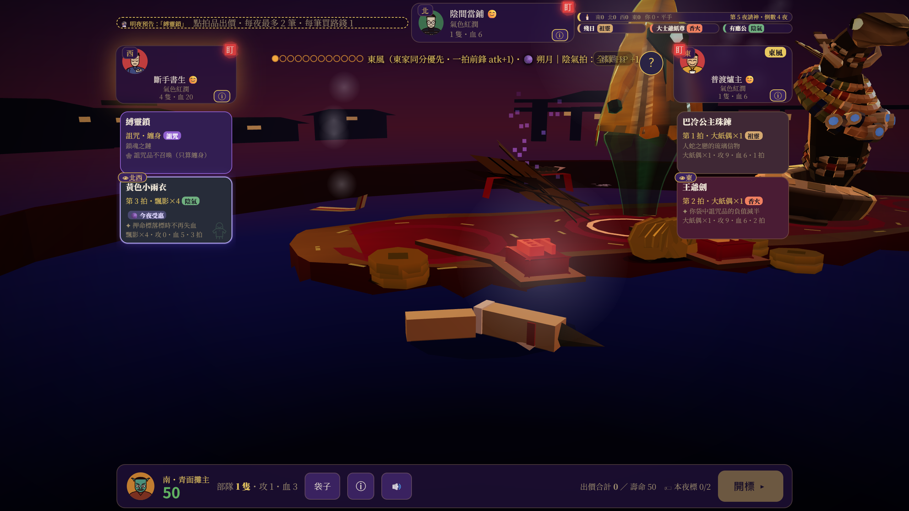

# A1 開卷證據與進度

日期：2026-09-15｜基準：eafec13039117a4ce8262430a073e0af994c4b96 / v0.57.10

使用者已批准 A 方向、開始執行與依 HUD 空間自動退鏡。目前已實作共同取景、法寶頁籤焦點連動與介面配色，正在整合驗證，尚未發布。最新結果見 [EXECUTION.md](EXECUTION.md)。下列「本輪執行／圖像觀察」保留 S0 當時的歷史基線。

## 本輪執行

```powershell
node tests/tools/scene-shot.mjs docs/experiments/2026-09-15-a1-opening/baseline-desktop --port=8898 --gate --w=1280 --h=720
node --test tests/reveal-table.test.mjs tests/ui-hierarchy.test.mjs
```

- 截圖工具exit0、errors=[]，原始輸出 [baseline-desktop.json](baseline-desktop.json)。1280×720、DPR2、Chromium，PNG 2560×1440；未以CSS藏起HUD的牌桌圖用來做主觀察。table3d.png是工具明確隱藏UI的補充圖，不能拿它宣告HUD不遮擋。
- 生成5張圖：首頁、選角、牌桌、純3D牌桌、中途揭盅。主對話實際開啟牌桌與中途圖檢視。
- 此工具非perf模式未固定seed，因此這批是當前版觀察，不是可逐像素比較的同種子A/B。S1會先擴充既有工具固定seed與輸出，不用假設`--seed`對非perf也有效。
- 牌桌取樣78 calls、18,274 tris、exposure1.1、sRGB、shadow=false；不是fps壓測。info.calls=1是後製合成，不是場景每幀成本。
- 既有揭盅／UI測試 **12/12通過，0失敗／跳過**，詳 [baseline-tests.txt](baseline-tests.txt)。是機械基線，不證明現有視覺問題已修。
- `git diff --name-only -- index.html js assets`空輸出：產品程式未因本卷改動；開場的其他工作樹資料保留。

## 圖像觀察


目前畫面有4張可見卡、四槽托盤與席位資訊；仍是紫色面板為主。A1要建立桌面與UI同一套美術語言。這不是A方向完成圖。



中途近景可見模型上端超出畫面，側欄遮到模型。這是本卷修正反例，並非演出完成驗收。

手機既有基線：[上一輪844×390牌桌](../2026-09-15-astra-review/astra-review-2026-09-15-table.png)、[852×393合成安全區卡片報告](../2026-09-15-market-card-readability/README.md)、[印籌分配報告](../2026-09-15-table-stamps.md)。不冒稱本輪新增Safari真機或全套768/256結果。

## 進度

| 步驟 | 狀態 |
|---|---|
| S0 總藍圖／開卷／基線 | 文件與基線已建立；獨立文件審查結果見下 |
| S1 資訊／3D共同構圖 | 自動取景、真實四頁籤切換、印籌聯合取景已實作；卡片 768／印籌 256 通過 |
| S2 A美術整合 | 漆木／紙色介面已實作，同 seed37 桌機前後圖已檢視；最終 PNG 已檢視；相對性能仍 RED |
| S3 揭盅完整路徑 | 原速／跳過／轉向／reduced 已驗證；最後 core 07124ed 完整 1599 組全過、零錯誤 |
| S4 整合／試玩發布 | v0.57.11 已公開供試玩，HTML 與四份資產逐位元組一致；速度比未過，真機最終驗收另列 |

## 續接入口

[總藍圖](../../MASTER_BLUEPRINT.md)／[計畫](../../../plans/2026-09-15-a1-premium-table.md)／[凍結檔](../2026-09-15-acceptance-a1-premium-table.md)

下一步不需要再選 A；按 EXECUTION 的剩餘整合檢查接續。D2/D3/D5、原P4/M-A1及其三輪歷史保持未決／未過狀態。

## S0 當時的文件驗證與獨立覆核（歷史紀錄）

- 總藍圖76個唯一追蹤ID，無重複；四份主交付文件的Markdown相對連結全部存在，brokenLinks=[]。
- `git diff --check` exit0；僅Git LF→CRLF提示。產品檔案無本輪diff。
- 獨立Astra第一輪確認舊七章無重要遺漏、授權邊界清楚；提出生命週期與靜態斷言兩處需精化。已補：G4活躍／終點／移除三態，不以null過關；S1先盤點凍結快照，不能為新構圖自行放寬測試。
- 第二輪針對兩處覆核通過。這是文件覆核，不是S1–S4成品或真機驗收。
- S0已完成；S1–S4維持待執行。所有圖均為v0.57.10基線，不標為A風格完成圖。
