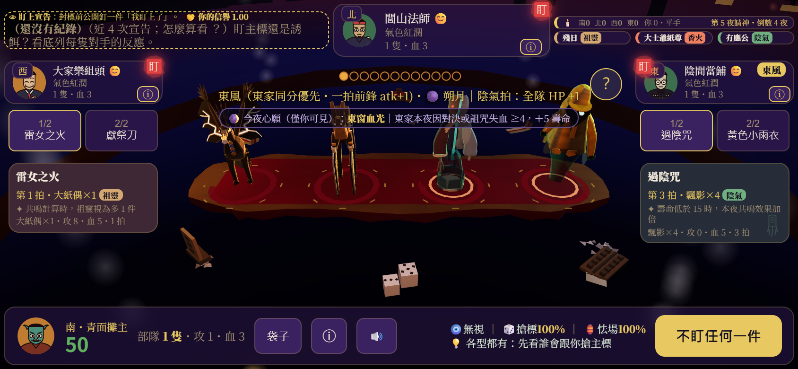
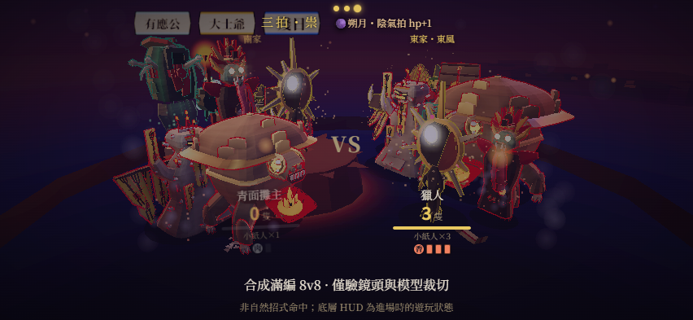

# 妖市：Astra 全遊戲檢視與精品製作藍圖

> **後續裁定（2026-09-15）**：使用者已要求合併為 [總藍圖](../MASTER_BLUEPRINT.md)，並明確選A方向開卷。[A1計畫](../../plans/2026-09-15-a1-premium-table.md)現為執行入口；下文保留初次檢視時的提案語氣。A不再待選，D2/D3/D5未因此批准。

日期：2026-09-15｜基準：`eafec13 / v0.57.10`｜狀態：製作方向提案，尚未取代既有凍結規格與排程。

## 1. 製作人結論

**把「用自己的命，買別人的報應」做成玩家一眼能懂、玩完會講給朋友聽的體驗。**

妖市最有價值的是壽命競標、不完全資訊與有作者的惡意。我的製作方向是「台灣志怪的精品桌上心理戰」：集中製作一張有在場感的神案、一套有重量的出價與揭盅，以及能看懂因果的紙紮夜戰。

所謂大作感，這裡定義為美術一致、操作可靠、聲畫有節制、決策有後果、內容有作者感。現階段不能把它等同於大型開放世界的資產量、全平台同時上市或大量服務型功能。

舊 `ROADMAP_V2.md` 的價值是想像力與功能覆蓋；不足是缺少「核心體驗尚未證明時，哪些投資應暫緩」的生產次序。新藍圖先證明品質標竿，再複製內容。

## 2. 本輪證據與界線

- 已讀：GAME_DESIGN、ARCH_SPEC、ART_BIBLE、ROADMAP_V2、09-10 評審、09-12 進度表、09-15 最新交接與相關原始程式。
- 玩家本輪回報：「試玩後通關，可以進行下一步」。記為整局試玩完成與允許續行；未提供卡切換、盯印歸屬的逐項答案或 fps，不能替代原 P4／M-A1／效能判定。
- 本輪重新執行 `node tests/tools/scene-shot.mjs scratchpad/astra-review-2026-09-15 --port=8897 --gate`，退出 0、`errors=[]`；已親看首頁、牌桌及揭盅中途畫面。
- 本輪牌桌探針：78 draw calls、19,403 triangles、ACES、exposure 1.1、sRGB、pixelRatio 2、shadow=false、environment=false。這是單場景取樣，非效能壓測。探針另一欄 calls=1 是後製合成，不能當整場成本。
- 已親看 v0.57.10 公開牌桌、09-15 合成 8v8 推鏡圖、有應公舞台圖。合成滿編圖只支援遮擋風險判讀，不能當自然對局或真機證據。
- 本輪沒有親自完成整局、沒有手機硬體量測、沒有完成聲音聆聽審查或玩家留存研究。以下玩法／聲音／留存建議是設計假設。
- 上次交接記錄 40/40 測試、768 卡面、256 分配通過。本輪蒐證代理另外回報逐一執行既有測試檔均通過；尚未保存本輪統一測試日誌，不將這份回報當成新發布驗收。

### 畫面證據

牌桌：側卡已能容納說明，但耳語、風位、心願、請神與玩家狀態同時搶注意；中央資訊帶穿過法寶上半身。需要重整階段資訊優先級。

揭盅：推鏡時模型上端超出畫面／進入 HUD 區；放大主體與保留所有面板之間沒有共同構圖契約。

滿編合成：大形體與旗幟互相覆蓋，輪廓亮線很多。這是「誰對誰做了什麼」的閱讀問題，單純加光或放大不足以解決。

## 3. 六個面向的專業診斷

| 面向 | 值得保留 | 主要差距 | 製作決策 |
|---|---|---|---|
| 玩法 | 花命搶標、毒標針對人、盯上形成心理戰 | 系統多，新手未必理解勝敗由哪筆決策造成；壽命經濟是否抑制滾雪球仍需量測 | 先把每夜的預期、代價、結果串起來，再擴充配方 |
| 創意 | 民俗信仰與交易資源可以互相解釋 | 部分民俗目前停留在名字、顏色、招式；連鎖容易變背配方 | 讓器物來歷、對手恩怨與競標行為互相呼應 |
| 美術 | ART_BIBLE 已有三系剪影、材質與節奏文法 | 表情符號、扁平頭像、紫色面板、幾何紙偶的完成度與語氣不一致 | 用一張風格標準桌統一字體、頭像、材質、道具與光照 |
| 3D | 真 3D 托盤、印籌、法寶與鏡頭已有骨架 | 拍品多以召喚體呈現；原始器物與戰鬥化身的關係可能不清，滿編遮擋、飛行裁切仍在 | 定義器物→顯靈→紙紮戰鬥的視覺語法；先解構圖與尺度 |
| 操作／節奏 | 手機卡片切換已修、每拍短推與分級存在 | 同時可見的規則太多，普通拍與高光缺乏足夠注意力差 | 每階段一個主問題、一個主動作；保留查閱與跳過 |
| 留存／產品 | 一局可通關，角色與法寶足以支撐探索 | 未有充分證據顯示玩家主動再開一局；聯網與局外經濟還是規劃 | 先驗證「我想換個方法再玩」，再建立天梯與經濟 |

不給沒有量測依據的整體分數。現況適合稱為已有豐富系統的可玩版本；尚不能用測試綠燈證明精品完成度。

## 4. 體驗支柱與一夜的導演腳本

### 三個品質支柱

1. **我知道自己在賭什麼。** 操作前能讀到自己的成本與可能收益；不洩漏對手私有資料，不把不確定結果寫成保證。
2. **我知道報應從哪裡來。** 結果能指向公開可知的出價、毒標與法寶作用；結算視圖使用同一份引擎事件，避免另算數字。
3. **這張桌只有妖市有。** 台灣民俗器物、說話方式、停頓與聲音共同建立身分；遵守真實參照與不可愛規範。

### 示範一夜：既有規則上的呈現提案

| 階段 | 玩家心中的問題 | 聲畫焦點 | 必须保留的功能 |
|---|---|---|---|
| 看貨 | 今晚哪件值得冒險？ | 選中拍品受主光，卡片交代能力與自己的條件 | 所有拍品可切換、完整說明可查 |
| 盯上 | 他是在嚇我，還是真要？ | 印籌落桌，座位與目標連結清楚 | 不靠顏色單獨辨別，不暗示 AI 私有出價 |
| 下標 | 我願意付幾年命？ | 籌碼移動與自己的剩餘預算同步 | 規則原有的撤改、上限與送出守衛 |
| 揭盅 | 我看穿他了嗎？ | 先留短暫期待，再亮赢家、代價與拍品歸屬 | 跳過得到相同結果，快速連點不重算 |
| 夜戰 | 剛才買的東西有用嗎？ | 當拍作用來源→對象→結果；普通效果克制，高光才集中 | 原三拍規則、兵數與傷害保持正確 |
| 天明 | 下一夜我要怎麼修正？ | 一句主要因果＋可展開帳本 | 私有資訊邊界、完整結果與下一步操作 |

不以增加不可跳過演出換取氣氛。先量決策時間與等待時間，再決定是否改既有時長。

## 5. 美術方向：三個可選方案

以下是文字構圖提案，尚未做新風格效果圖，不能當作已完成的美術樣張或已選定方向。建議先選產品取向，再做同場景 A/B 圖；真正改風格前由製作人看圖裁定。

| 方向 | 畫面示意與預期感受 | 製作代價 | 適合程度 |
|---|---|---|---|
| **A 廟埕暗桌・紙紮顯靈（推薦）** | 近景舊神案與手邊命籌，中景紅布器物，後景人影與廟口；暖光只抓拍品，冷暗留在桌外 | 要做材質與器物標竿、重整 HUD 和構圖；可延續既有風格化模型 | 最能放大拍賣心理戰與手機桌面空間 |
| B 民俗戲台・儀式展演 | 桌面化為布景戲台，角色剪影與布旗分幕，招式像一次儀式亮相 | 動畫、舞台調度和音樂投入較高；容易讓演出擠壓決策 | 若最重視戰鬥觀賞性可選，但必須守住拍賣支柱 |
| C 陰廟寫實・近距離驚悚 | 實物般木漆、濕布、香灰與低光，近距離看見手工痕跡 | 需要新的建模／貼圖／材質管線與手機品質分級，現有角色需大量重新製作 | 視覺跨度最大，現階段成本與技術風險最高 |

我的推薦是 A，局部吸收 B 的高光節奏。C 保留為後續研究，不先把整個遊戲搬去新引擎。

### 具體美術製作方式

- 先選三件現有法寶各代表一系，外加一件詛咒、一尊傳說，做「單件英雄視角／桌面實際大小／滿編戰鬥」三種尺寸驗收。模型放大好看卻縮小認不得，不能量產。
- 台灣民俗參照沿用 ART_BIBLE 的每件 2–3 張真實照片與 3–5 條一眼特徵。涉及族群內容按既有顧問要求辦理。
- 先解比例、剪影、材質區分、接地感，再增加碎瓷與符紙細節。常駐輪廓光只服務辨識，避免每個零件都變成發光線框。
- 法寶是器物還是化身，先以一件示範建立一致轉換；若改模型與資產規範，另開美術卷。
- 畫面明暗分三層：當前操作最清楚、周邊玩家可掃讀、環境提供氣氛。紫色全屏面板與模型的競爭用同場景對照解決。
- 文字、數字與按鈕繼續用 DOM；字體與邊框可以有民俗氣質，正文先保完整閱讀。沒有必要把所有介面都搬進 3D。
- 現有色彩管理、霧、補光與 bloom 已存在，不能把「開 ACES／加霧／加 bloom」列作新升級成果。
- 軟陰影、環境反射與材質管線都是候選實驗。用 A/B 畫面與實際成本裁定，不同時開滿後製。ART_BIBLE 對角色無貼圖等限制未被本提案改動。
- ART_BIBLE §8 的光照數值與現行 `scene-env.js` 存在版本漂移；下一卷先追溯已批准變更，再同步規範，不能直接把程式改回舊數字。
- 規格閱讀也要辨別沿革：GAME_DESIGN 現行請神同分採風位序，IMPLEMENTATION_GUIDE 還保留過往 RNG 洗牌說明；局末香火結清另有「未經使用者逐條裁定」註記。下一卷整理現行契約與歷史段落，不直接照舊文重製規則。

## 6. 玩法深度、D2 與創意

### 先驗證深度來自判斷

用實際新手與熟悉玩家訪談配合既有種子模擬，記錄：玩家為何下標、是否因對手行為改價、輸後能否提出不同策略。AI 平衡結果不能替代人類是否覺得有趣。

現有「壽命＝籌碼」是強支柱，但回血、落標費、請神與收益會影響實際經濟；不能只憑概念宣告滾雪球已被解決。

### D2：建議先以三組上限試驗，不一次量產六組

希望三組分別提供情報、風險處理與進攻取捨。每組都需回答：我何時不該追？對手如何回應？它是否讓某張牌成為固定必買？純粹多送戰力的組合要優先質疑。

「公開啟動、不公開內容」須修正文字精度：如果公開配方固定，公布「雙虎滅煞」就已透露相應材料至少曾滿足啟動條件。這不等於公開整個背包，但也不是沒有資訊外洩。

兩個實質選項：

- **首次實際生效時公開連鎖名稱與效果（推薦研究方向）**：讓對手讀懂因果並可回應；接受由配方推知部分持有資訊，須裁明時點與材料變動後語意。
- 僅向持有者提示組合，對手只見可公開的結果：保留更多猜測，但學習與戰鬥歸因較難，並需明確處理可視演出本身的洩漏。

兩案都未獲本輪批准。須先與原 D2、私有背包規則及效果公開時點一併裁定，再凍結 CHAINS schema、hook 順序、AI 估值、預覽、觸發與失效規則。沿用六之四與原 n≥10000 等門檻，不自行改小。

### 三個創意候選，不同時擴規則

1. **因果帳本**：把已有公開事件寫成一段短恩怨，讓玩家記得「誰害了我」。優先做呈現，禁止補寫未發生的因果。
2. **器物顯靈**：買到的是一件器物，關鍵時刻才顯出紙紮化身。先做一件展示，評估資產量與辨識改善。
3. **對手記性**：讓角色台詞對已公開的盯標／毒標作出反應。純台詞版先驗證人格感；若要影響 AI 或跨局記憶，另列規則與持久化提案。

## 7. D3、多人與長線產品

### 幽靈先證明遊戲語意

舊案「同種子桶精確重播」不足以保證反應忠實。玩家改變一件法寶的得標者，後续背包、壽命、可負擔出價甚至隨機消耗就可能分岔。這是需要實作反例測試的架構推論，本輪尚未完成驗證。

先做最小反例：同種子、同版本，只改真人一筆得標結果；逐夜檢查舊幽靈輸入是否合法、當時所見資訊是否相同。不能把超額出價裁小後仍稱為原玩家精確決策。

| 產品形式 | 能提供什麼 | 代價 |
|---|---|---|
| 同局回放／同題挑戰 | 重現原局，或比较相同挑戰條件下的表現 | 必须界定相同狀態；替換玩家後不能預設整局仍相同 |
| 歷史行為驅動的 AI 殘影 | 能對新狀態做合法反應、適合離線隨開 | 決策不再是原玩家原樣，需要誠實標示與新策略層 |
| 即時好友桌 | 真正互相讀人、搶貨、報復 | 網路、斷線、私有資訊、安全與運營成本最高 |

推薦將幽靈驗證與小規模好友桌研究列為兩個可獨立停止的風險原型，取消「幽靈必然是即時對戰地基」的假定。正式排程調整仍待製作人採納。

### 聯網架構原則

既有可重現引擎值得保留，但決定性只解決同步的一部分。私有背包／暗標若全部發到客戶端，即使 UI 藏起來也不構成保密。網路版應先定伺服器持有的真實狀態、每位玩家可見投影、輸入驗證、逾時裁決、重連快照與版本契約。

單純中繼輸入＋每端跑全狀態，不能被宣告為完整競技安全方案。若用 commit-reveal，也還要處理拒絕揭示、掉線與被提前送出的其他私有資料。這是後續架構卷，非本輪部署要求。

### 留存次序

先以局後復盤、再開一局、角色挑戰與少量夜行錄建立動機。建議延續競技內容全開，熟練度優先做身分與外觀；新增流派與熟練度邊界仍依 D5 另裁，避免將選擇權鎖在遊玩時數後面。商業模式尚未定案，不先把抽卡與日課當作必做。天梯需要可信對局與足夠真人供給，排在驗證之後。

## 8. 生產里程碑與驗收

以下順序是**替代排程提案**。舊版「連鎖→幽靈」仍是現行紀錄，未因本文自動改動。所有新研究問題先記錄結果；尚未核准的數字不得變成正式門檻。

| 里程碑 | 交付物／邊界 | 出場條件 | 依賴 |
|---|---|---|---|
| M0 基線與決策 | 維護現有已知失敗清單、完整一局錄影、方向 A/B 同景稿、確定目標平台優先序 | 製作人選品質方向；既有門檻與新增門檻分開保存 | 本報告 |
| M1 標準牌桌 | 一張桌、一個完整競標與揭盅流程；卡片、印籌、鏡頭、字體共同構圖 | 真機可切換閱讀與辨別歸屬；既有布局／追蹤等價檢查；飛行安全區按原門檻驗 | M0 |
| M2 因果清楚的夜戰 | 當拍來源／目標／結果階層，三系標竿法寶，滿編與一尊傳說 | 原 P4／M-A1 按既有裁定處置，不能重新命名成新測試來洗掉失敗；真機、reduced、跳過驗證 | M1 的構圖契約 |
| M3 精品完整切片 | 選既有種子覆蓋主要體驗，完整 12 夜仍可玩；聲音、短台詞、局後帳本 | 初見玩家能說明主要勝敗因果與下一局想嘗試的改變；統計樣本和門檻另行凍結 | M1+M2 |
| M4 玩法擴充試驗 | D2 裁定後首批最多三組連鎖；灰盒先驗證，再做專屬美術 | 原平衡／窮舉門檻、AI/UI 規則一致、關閉連鎖時基準等價 | M3 與 D2 |
| M5 多人可行性 | D3 分岔反例、輸入紀錄契約、好友桌私有資訊模型 | 能明確選擇回放、殘影或即時產品；非法輸入、重連與版本錯誤有可測規格 | M0 後可做唯讀／隔離研究；正式版依 D3 |
| M6 內容與上市準備 | 複製已驗證管線，擴夜行錄、外觀、裝置測試、語言與發行包 | 品質預算穩定、目標裝置長局測試、恢復流程、素材來源與商店交付完成 | M3；依產品選擇加入 M4/M5 |

不憑現有資料承諾日曆工期或金額。先完成 M1 的一個標準單位，記錄美術、工程、聲音、驗收各自工時，再據此估剩餘內容。角色量產、UI、聲音、網路需要不同專業；AI 生產初稿不能代替藝術裁定、真機測試與玩家研究。

### 每卷都帶著走的工程交接

- 現況入口：`index.html` 規則／UI、`js/table-props.js` 桌上互動、`js/duel-figures.js` 排陣、`js/camera-director.js` 鏡頭、`js/renderer.js`／`scene-env.js` 渲染、`ART_BIBLE.md` 美術規範。
- 保留資料表／hook 與演出分離；不為整潔一次重寫單檔。當新卷需要時，逐步抽出版本化的輸入、事件、可見狀態与資產清單。
- 每個里程碑切成可獨立回復的單一變更；先附提案、影響範圍、凍結標準、測試命令與復原方式。美術改動另附同機位前後圖。
- 常用驗證：`node --test tests/*.test.mjs`、對應卷既有 screenshot／layout／trace 工具、`git diff --check`。不把通用工具輸出取代各卷專用閘門。
- 變更失敗時撤回該卷程式／資產提交，保留失敗證據；有存檔格式改動則先設版本遷移與相容策略，不能只靠 git revert。
- Astra 負責體驗方向與最終视觉裁定；有界事實盤點、機械修改與測試可委派。美術與聲音在構圖契約確定後可並行；鏡頭、HUD、安全區共享檔案，避免同時互相覆蓋。

## 9. 第一卷建議與需要裁定的內容

**推薦下一卷：M0→M1「精品牌桌與揭盅」；先做 A 方向同景稿，再依選定圖落地。**

具體範圍：資訊帶與模型共同安全區、揭盅全路徑構圖、牌桌與 UI 美術語言、法寶／印籌歸屬。使用既有三系法寶驗構圖；三系標竿資產製作與滿編驗收歸 M2。沿用當前玩法，不將 D2／D3 混進這一卷。

製作人這次需要選的是「是否採 A 方向與品質優先的替代排程」。D2 的公開時點與 D3 的產品形式等反例研究後再裁；不要求現在一次批准整份藍圖所有想法。

## 10. 外部參考與閱讀方法

- [Daniel Mullins：Inscryption 開發回顧，GDC 2022](https://www.gdcvault.com/play/1027609/Independent-Games-Summit-Sacrifices-Were)：官方介紹記錄它從十分鐘 game jam 原型演變為較長作品。本案借鏡「先建立鮮明的小體驗再擴展」的製作方法，不以其商業結果預測妖市。
- 本文主要結論來自本專案規格、實作與截圖；尚未做完整競品／市場調查，不宣稱題材或機制是市場唯一。

## 11. 已知保留項

有應公 M-A1、原 P4、滿編遮擋、揭盅飛行碰頂與效能限制依最新交接保留。歷史三輪未過的問題不自行重啟第四輪；若需新方案，先說明原假設與本次方向改變，再請製作人裁定。

本輪只新增檢視與製作文件、截圖證據；沒有改遊戲、改驗收門檻或發布版本。

獨立 Astra 文件反駁檢視：無重大問題；已依建議分清 M1 構圖與 M2 資產製作範圍，並明示 D5 仍待裁。此為方向／規格審查，不代替畫面或真機獨立驗收。
