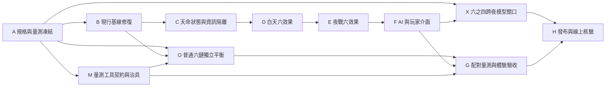

# 妖市：天命密函與六組真連鎖施工藍圖

日期：2026-09-23。狀態：**施工中，尚未達發布關口**。基準為 `feat/l1-water-chain`／`2eb164d`／產品 `v0.57.40`。本計畫承接[獨立審視與 Premortem](../docs/reviews/2026-09-23-destiny-premortem.md)及[Antigravity 原始需求](../.agents/ORIGINAL_REQUEST.md)，目標仍是可驗證的 `v0.57.41`，不是只做六組特效或湊滿測試數字。

進度（2026-09-24）：A 契約已凍結；B 基線修復已完成，B 階段完整 `node --test` 曾 **211/211 通過**（含約 14 分鐘音效真瀏覽器測試）。C 的抽籤／覺醒／逐件資訊投影、D/E 六組白天與夜戰原案及獨立候選、F 的 AI 追件與玩家說明已實作，844×390、1280×720 實際畫面與椅仔姑逐件揭露已檢查。M 的六組真版六臂及普通版 H1/H9 各七臂均已完成固定 **每臂 10,000 局**，私有 raw、完整來源雜湊和配對摘要留在 `scratchpad/`；[綜合審視](../docs/reviews/2026-09-23-destiny-final-review.md)記錄門檻、限制與 Premortem。後續改動的快測逐檔重跑 **266/266 通過**；最新長時音效原測曾在自動推進「下一件拍品」時失敗，只加失敗診斷的等價副本後來 **1/1 通過**，間歇原因未定位。普通雙虎／血祭 H9 仍 `fail`、千眼 H9 仍 `incomplete`；修正版活動探針完成三臂各 10,000 局，端點全數吻合且 16,582 組活動席位對持有人紀錄無不符；新增逐件配對回放再完成雙虎／血祭各 10,000 對，三臂終局逐欄吻合舊 raw。雙虎／血祭 normal−zero 對局的最終勝者分別有 417、190 局改變；同件存活席位出價分歧率為 0.77%、0.24%；雙虎確認 4,310 筆實付多 1，血祭同出價拍品有 203/366,462 個得標者不同；相同夜次、同兩名對手戰果也已配對。詳細分母與非因果限制見[H9 診斷](../docs/experiments/2026-09-23-destiny/h9-diagnostic.md)。真版全局安全帶過；覺醒前同態 checkpoint 焦點比較完成 10,000 seeds／4,886 覺醒點，[結果](../docs/experiments/2026-09-23-destiny/focus-report.md)為四鏈 fail、兩鏈 incomplete。**補充千眼策略診斷已完成**：知情對增量盲策略每臂 10,000 seeds，知情標單在 18.69% 對局至少改變一次，座位 0 配對勝率差 −0.18pp（95% 配對 bootstrap −0.44..+0.08），不改舊 H9 `incomplete`；[補充報告](../docs/experiments/2026-09-24-eyes-informed-supplement/report.md)另附六張實際千眼 UI 畫面。手機私函可捲動但關閉鈕在首屏下方；四件預告未標示額外第四件。五人真人冷讀的[主持記分表](../docs/experiments/2026-09-24-eyes-informed-supplement/blindread-scorecard.md)已備妥，尚待實測。下一步仍須真人冷讀／盲讀，再設新候選和事前驗收；長時音效間歇問題、X 六之四跨夜模型及 H 發布未完成。原版與候選版目前都不能宣稱已達平衡或發布驗收。

X 補進度（2026-09-24）：新增只讀的[六之四模型契約盤點器](../docs/experiments/2026-09-23-destiny/model-contract-audit.md)；依凍結來源驗證 25 個符號引用，找出 5 個行號提示偏移、9 項 adapter 缺漏與 1 項部分完成。它另確認舊契約只涵蓋三鏈，缺現行六鏈中的血祭／神王／長明，也沒有私有天命六臂。這個工具是 fail-closed 盤點交付，不是 adapter 驗收或求解；`sixOfFour` 仍 incomplete、`releaseEligible=false`。下一工程是版本化擴展契約與第一批 state/chance/資訊集合引擎 fixtures，不能把此盤點當模型通過。

## 不變的產品決策與待驗證取捨

- 六組**普通**跨系連鎖對所有席位開放。四席各自秘密抽 **一封**天命，有放回、允許撞籤；只有自己的指定配方在拍賣桌成型，才覺醒相應真效果。此處沿用使用者已選的 `1.B`，不在實作途中改成排他抽籤或兩封擇一。
- 對手未覺醒的天命只在 UI 顯示占位；覺醒後公開名稱與結果。單機 JS 不能宣稱提供伺服器級保密。公開回放不可預先寫出秘密內容。
- [審視報告 §3](../docs/reviews/2026-09-23-destiny-premortem.md)的六組削峰方案是 **待驗證候選，尚非已批准的最優規則**。在 A 開工前逐項凍結原 R2 或修訂版的觸發、數值與理由；沒有明確新裁定的項目以[原始需求](../.agents/ORIGINAL_REQUEST.md)為準。原案與候選必須同種子、同策略比較，不能先把候選寫進 D 再宣稱它比較好。特別核對神王供奉、血祭落標 35%、長明並列最低。
- 本輪離線代理僅見 `122/600` 局至少一席成型，尚未包含 AI 天命追件。先維持一封暗抽，觀察實作後頻率與玩家理解；若「稀有驚喜」與「改版主角」定位不符，將兩封擇一作**另案**比較，而非悄悄改 R1。
- 保留既有 A2／A3／H9 的歷史裁定與未過證據。修本功能的真實缺陷，不以改測試門檻、美化文字或更換種子讓報告過關。

## 依賴圖

`M` 的工具契約與 `X` 的模型接線可和 `B`～`F` 分支工作並行；`O` 的正式普通版量測須等 B/M，`X` 的最終求解與真版 G 須等 F。產品邏輯集中在 `index.html`，`B`～`F` 應按順序落地，避免同檔並行改動。每步保留可回退提交；`.agents/` 為 Antigravity 原始交接，不納入產品提交。

## A｜凍結規則、反例與量測（設計關口）

**現況**：原始 R1–R4 有效果描述，缺結算順序、同分、重複來源、施術隊死亡、公開投影與數值比較的正式契約。過去 8 萬局只測前三組普通版且 H9 有已知缺口。

**交付**：`docs/experiments/2026-09-23-destiny/acceptance.md`、`premortem.md`、機器可讀的實驗臂設定。將六組每個真效果拆為「觸發／來源存活／作用域／一夜或一戰上限／事件文字／與夜規及既有法寶優先序」，在此步逐項凍結原案或經明確裁定的候選及差異理由。固定 seeds、席位、角色、六組普通版各自的無鏈／去效果對照、原 R2 真版、修訂真版；事先訂每組勝率差、成本／失血、局長與覺醒率的數值門檻及不確定區間。早／中／晚覺醒、撞籤、低血、夜規、交叉戰的每格最低事件數也要先定；不足則標 `incomplete`，另用合法定向局面驗機制，不能拿定向局面冒充自然發生率。舊六之四完整跨夜模型若未接好，只能標 `incomplete`，不得以萬局代替。

**退出**：所有 R1–R4 項目都有具體反例和判準；每項以原案或已裁修訂案定稿，數值閘門與分母在看到正式結果前凍結，沒有「日後再看」卻直接接線的空白。此步不調產品數值；A 未完成，不得進入 D／G 的數值採用。

## B｜清理現行基線（獨立修補）

**現況**：`VERSION=0.57.39` 與 `RELEASE_VERSION=0.57.40` 不一致，`tests/release-update.test.mjs` 0/2；擴大測試 197/203，另 6 項失敗分屬舊治具和舊種子預期。押寶夜 UI 預算漏水陸免買路錢／雙虎加費。`pwHaunt`／`pwFeed` 註解稱「本尊」，但程式採整側存活；[2026-09-07 凍結驗收](../docs/experiments/2026-09-07-acceptance-duel-desync.md)只要求整側全滅不施術，不能把來源隊存活當成已確認的普通版缺陷。SFX 長測尚未重跑。

**交付**：先用行為測試重現每個**產品缺陷**，修版本單一來源、押寶夜依實際得標／最後押注拍品決定的條件費用；普通版整側存活規則保持不變，清楚修正誤導的註解並以定向反例記下來源隊死亡後仍施術的行為，真版來源存活由 A/E 單獨定案。更新測試治具與過期因果預期時保留舊版原始紀錄、解釋新舊差異，不只改 expected。記錄 SFX 長測結果與可重現卡點。

**驗證**：`node --test tests/release-update.test.mjs tests/curse-effects.test.mjs tests/l1-balance.test.mjs tests/ledger-attribution.test.mjs tests/ledger-tools.test.mjs`；另做押寶夜條件費用與整側存活的具體局面斷言，B 不藉新註解偷偷調普通版戰果。全測基線另記 `sfx-wiring` 的狀態。`index.html` 的 UTF-8／CRLF 比例維持 100%。

**退出**：上述紅燈原因逐一消除或明列未修原因；所有修補有行為證據。尚未加入任何真天命數值，能與 `2eb164d` 對照。

## C｜天命狀態、一次覺醒與保密投影

**現況**：`makeState` 沒有 `destiny`；`activeChains` 只有普通效果；`observeBagMutation` 的 recorder 是 opt-in 診斷入口，不能直接當成玩家狀態鉤子。

**交付**：四席使用與公開市場種子、戰鬥分離的安全亂數各抽一封；正式量測保存每局私有抽籤輸入，同 `(局種子, 四封函)` 可重現。逐席儲存 `destiny` 與一次性 `destinyAwakened`。以實際拍賣入袋事件判斷從未成型到成型，不用 UI 預覽、試算袋子或非拍賣取得後的無關得標覺醒；普通連鎖保持原語意。建立 private/public 的**資料投影函式**，讓袋子、熱座交棒、回放與公告用同一條保密契約。私函初始可讀，覺醒時公開一條事件。獨立覆審證明公開首夜市場可枚舉出局種子，故不能從公開種子推導天命。

**驗證**：新增 `tests/l1-destiny-chains.test.mjs`，涵蓋同 `(seed, 四封函)` 重現、同公開 seed 不同密函、四席有放回、撞籤、空袋與重複材料、補件取得與失去、非指定連鎖、同夜多次 mutation、玩家死亡、熱座和回放隱私；既有非天命 trace 的 RNG 行為另做對照。

**退出**：不啟用任何真數值時，普通玩法結果與 **B 修補後的凍結提交**一致；相對 `2eb164d` 的預期差異由 B 單列。全桌只在應揭露那一刻知道指定連鎖，公告不重播。

## D｜白天六效果與收支單一事實來源

**現況**：`resolveAuction`、請神 `awardLegend`／`settleTithe`、千眼 `prevPreview` 分散在引擎和 UI；夜規 `luopo` 有優先序，孝女及黃色小雨衣另有保命鉤子。

**交付**：六組真效果以獨立資料／hook 掛載，只對 `p.destiny` 已覺醒者生效。實作雙虎 35% 條件、水陸零得標補貼、千眼逐席四件預告和折讓、神王請神恩典、血祭押命 35%、長明最低壽命額外回補。建立每筆費用的**引擎共用試算**供一般及押寶夜 UI 用，避免再次顯示錯價。

**驗證**：每組至少各有得標、落標、零有效標、同夜多標、盯印、雨衣、孝女、落魄夜、押寶夜、請神夜、最低壽命同分與底限 1 的實付斷言；雨衣「不失血」優先序、椅仔姑壽命資訊僅合法席可見及空對象安全都列為必過邊界。無真天命席位在相同局面與現有普通連鎖逐值相等。

**退出**：所有白天成本 UI 與引擎相等；沒有免費印壽命、事後公開秘密或普通效果被真效果覆蓋。

## E｜夜戰六效果與來源存活

**現況**：`paperWar` 三拍已含標準虎、水、眼、神、血、長明效果。直接改普通 `CHAINS` 欄位會把真效果送給所有持有者，必須隔離。重複法寶及施術隊死亡會放大多次觸發風險。

**交付**：真虎首位前鋒降攻、真水抓交替成功後小兵增血、真眼首拍破甲、真神王天誅擊毀後限時加攻、真血反噬 2、真長明進食護盾；共用 `sourceAlive` 類判準，事件時間軸與部隊預覽如實顯示。維持戰鬥三拍；`PW_MIN/PW_MAX` 是敗方扣血界限，不能當演出時長。另查 `PW_FX.BEAT_MIN_MS_BY_TIER`、事件排程與 `tests/tools/duel-drive.mjs`，驗 R3 指定的 200–300 ms 快速路徑及完整對決總時長。

**驗證**：逐拍 `beats`／存活數／血量斷言，覆蓋無目標、`t.tr`／`foe` 為空、無隊伍 trait、雙方有先手、重複刀／弓／甕、施術隊先死、護盾到期、同時死亡與送王船第二拍吸收；另量拍間最短路徑及總牆鐘時間，不能只驗引擎三拍。對每個新效果至少用一個突變可使測試轉紅。

**退出**：不因來源死亡觸發幽靈技能；沒有無限護盾或三拍外延長；普通鏈與真鏈的戰果差可歸因。

## F｜AI 決策、私有 UI 與覺醒演出

**現況**：AI 現在只對補齊普通鏈加估值；真人袋子已有六條狀態，橫式窄畫面資訊密度高。天命暗抽尚無可見入口。

**交付**：AI 只讀自己的天命和合法市場資訊，按規格在壽命 `>=18` 評估需件時加權，低於 18 不加；第一件與補齊件的差別在 A 契約定義。`showBag`、`paintSheet`、拍品與 3D 引線只展示當前席合法私有資訊；開標金色神諭不遮主鈕、出價金額或得標卡。加低動態與聲音退路。

**追加核對**：B 的獨立覆審發現 AI 出價規劃仍以固定 `CFG.BID_FEE` 估算預算。F 須讓 AI 對水陸免費、雙虎加費與盯印折讓使用和引擎一致的條件費用，否則追件 +2 的平衡資料會混入錯誤預算決策。

**驗證**：AI 同 seed 的價值／出價差由新增權重造成且不讀對手密函；844×390、1280×720、熱座交棒、低動態、覺醒開標的實際截圖和 pageerror=0；人工核對「誰覺醒、靠哪兩件、實際多了什麼」，文字可在手機橫式讀完。

**退出**：情報不洩漏，普通補件與真天命提示可區分；演出可讀且不妨礙下注／揭盅。影響畫面的改動依 `threejs-visual-loop` 再做截圖檢視。

## M｜量測工具與診斷契約（可獨立準備）

**現況**：`tests/tools/l1-formal.mjs` 與舊 raw 只涵蓋前三組普通版；原 H9 的持有者差不是因果，千眼原桌不消費情報，跨夜六之四不完整。

**交付**：實驗臂可獨立關每組普通連鎖、關全部普通連鎖、只關真效果、切原 R2 或修訂真效果；開關不改抽籤、無關配方或其他 AI 策略。保留每局抽籤、覺醒夜、四席結果、逐夜收支／回補、戰鬥與局長，記程式／工具 SHA256、角色、策略、CFG、種子與失敗狀態。事前契約分「六組普通鏈本身」「同底座的原案對候選」「普通對真版增量」「固定基準觸發群戰果」「AI 知情策略」；不同分母不混報，沒有完整跨夜模型即標 `incomplete`。

**驗證**：工具測試用刻意翻轉獲勝者、漏種子、重複種子、混 hash、空分母、秘密洩漏的突變，確認會紅；試跑小樣本只查工具有效，不用來調值或宣稱平衡。

**退出**：主實驗一次執行能重現並保留原始逐局資料；臂名、範圍和不成立的推論都寫清楚。

## O｜普通六連鎖獨立稽核

**現況**：舊八萬局只對水陸／雙虎／千眼普通鏈建正式對照；`v0.57.40` 新增普通神王／血祭／長明後，六組整體的因果平衡尚無正式證據。先讀 `docs/experiments/2026-09-21-l1e-formal/acceptance.md` 和 `tests/tools/l1-formal.mjs`，不要把已知 H9 診斷當通過。

**交付**：在 `tests/tools/` 建六組各自的去效果反事實臂及適當的無鏈／固定策略對照，保留相同 seed、角色、策略與市場；量各組追件誘因、持有者、勝率差、實付／失血、局長、出局夜和可利用重複來源，三組新鏈不能借前三組的結果過關。把 H9 條件分母與全局因果差分開報告。

**驗證與退出**：依 A 凍結的每組門檻、最小有效樣本與區間報 pass／fail／incomplete；原始逐局資料可重算。任何一組只因沒有足夠持有者而無法判定，不能寫「六組已平衡」。此步只稽核普通版，不更動天命規則。

## G｜平衡、Premortem 與玩家體驗驗收

**現況**：`v0.57.41` 沒有任何正式數值資料。最可疑的是早覺醒神王滾雪球、雙虎對敗標者的負回饋、長明回血加護盾的拖局；單封暗抽的可見率也偏低。

**交付**：按 A/M 凍結的配置跑六組同種子配對對照，至少每臂 `n>=10000`；同一組原 R2、修訂候選與普通版要有配對差及玩家理解成本，先看神王／雙虎／血祭／長明高風險項。將早／中／晚覺醒、四席撞籤、殘血、押寶／落魄／請神夜、各真鏈交叉對戰分層；逐格列事件數、區間及 A 的最小分母，稀有互動加合法定向局面試驗，空格只能 `incomplete`。保留原始數據與效果活性，不以先觀察到的結果回挑策略或種子。對 3D／UI 加真人理解訪談或盲讀，與 A2/A3 舊卷分開。

**退出**：O 的六組普通版和 G 的六組真版都逐項滿足 A 的數值門檻、樣本數、區間及可讀性判準，沒有未解 HIGH 級可利用策略、錯價、滾雪球或不可讀事件；若數值需改，新增候選臂並重跑凍結驗收，不覆寫失敗 raw。未過或分層稀疏時保留候選，不稱「最佳優化版」。H9 舊缺口與完整六之四若仍未閉合，報告明示限制。

## X｜六之四完整跨夜模型關口

**現況**：[舊驗收](../docs/experiments/2026-09-21-l1-water/acceptance.md)第 35 行規定正式發布須六之四與萬局平衡；[模型契約](../docs/experiments/2026-09-21-l1e-formal/model-contract.md)目前 `sixOfFour=incomplete`、`releaseEligible=false`。H9 的已知診斷裁定不等於此發布豁免。

**交付**：依 `model-contract.json` 完成可跑 contract auditor、合法動作／chance 權重／資訊集合／state snapshot 與 freeLunch 收益映射的缺口，將原三組範圍擴至現行六組普通鏈及天命真版，新增私函資訊集合與有放回抽籤支持集；用真引擎逐項比對 adapter，再對所聲稱完整範圍求解或明確證明可行的等價縮減。`tests/l1-formal.test.mjs` 驗缺相位、漏 chance、錯資訊、未定收益一律 fail closed。

**退出**：有可重現的完整跨夜結果及獨立覆審，正式 `sixOfFour=pass` 才進 H。若目前計算規模不可行，提出帶實際探針、縮減證明與殘餘風險的**新發布決策**供使用者另行裁定；在新裁定之前只能停候選分支，不能把萬局或文字揭露當通關。

## H｜整合、發布與回退

**現況**：原始需求要求合入 `main`、推遠端與 curl 核對 `0.57.41`；目前不得發布，因規格、測試及量測都未過。

**交付**：先全套測試（含長時 SFX）、指定 44 項、天命測試、手機與桌面實際畫面、UTF-8/CRLF 和 git diff 稽核。把 `VERSION`、`RELEASE_VERSION`、首頁字串、資產 query 統一到 `0.57.41`，更新玩家可讀規則、差異與已知限制。舊 H9 水陸／雙虎 fail、千眼 incomplete 必須依原口徑修復或有使用者看過具體失敗後的**新發布裁定**；O/G/X 閘門亦須通過（X 的例外同樣需新裁定），才審閱合入 `main`、推 `origin`，用公開 URL 的 `curl` 核對版本及資產回應，留下部署證據；有問題時用上一版 commit 回退。

**退出**：線上實際送達 `0.57.41`，所有必要閘門都有可重現證據，沒有用 narrow 44/44 冒稱全套通過。若舊 H9 或 X 仍 fail／`incomplete` 且無對應新發布裁定，或 O/G 任一未過，就停在候選分支並列具體未過項，不強行部署。

## 執行原則

每步開始先讀相應凍結契約與目前工作樹；測試只證明自己實際覆蓋的行為。`index.html` 專案要求 UTF-8／CRLF，每次改動後檢查。選項或門檻一旦改動，更新 A 的決策紀錄並標註新舊數據不可混用。玩家可見視覺與核心體驗由 Astra 判定方向及最終可讀性，其他例行修補不能自行改變此方向。文檔與原始失敗證據保留；完成證據不足時不宣布放行。

### 冷啟動執行卡與回退點

下表列的是每步**最小**驗證；在該步實作時仍須按凍結驗收補齊行為測試。`（新建）` 的檔案尚不存在，表內命令需待該步交付後執行；量測腳本介面亦在 A/M 固定，不把下列範例當成已執行證據。

| 步 | 先讀與主要檔案 | 最小驗證命令／產物 | 回退與審查 |
|---|---|---|---|
| A | `.agents/ORIGINAL_REQUEST.md`、`docs/reviews/2026-09-23-destiny-premortem.md`、`docs/experiments/2026-09-21-l1-water/acceptance.md`；新建 `docs/experiments/2026-09-23-destiny/acceptance.md` | 人工逐項對照 R1–R4；驗收表每項有分母、閘門與裁定來源 | 只提交規格；有爭議回退 A 文檔，不碰產品 |
| B | `index.html`、`tests/release-update.test.mjs`、`tests/curse-effects.test.mjs`、`tests/ledger-attribution.test.mjs` | `node --test tests/release-update.test.mjs tests/curse-effects.test.mjs tests/l1-balance.test.mjs tests/ledger-attribution.test.mjs tests/ledger-tools.test.mjs` | 修補單獨提交；記 SHA 作 C 的新基準，可單獨 revert |
| C | `index.html` 的 `makeState`／拍賣入袋／袋子與回放；新建 `tests/l1-destiny-chains.test.mjs` | `node --test tests/l1-destiny-chains.test.mjs tests/chains.test.mjs tests/l1-information.test.mjs` | 可關天命抽籤的隔離提交；不得回退 B 的產品修補 |
| D | `index.html` 的 `resolveAuction`／`updateBudget`／`awardLegend`／`settleTithe`；`tests/l1-tiger.test.mjs` | `node --test tests/l1-destiny-chains.test.mjs tests/l1-tiger.test.mjs tests/l1-tray-chain.test.mjs` | 白天六效果單獨提交；失敗即撤此提交，不改普通 `CHAINS` |
| E | `index.html` 的 `paperWar`／`PW_FX`；`tests/single-pass-duel.test.mjs`、`tests/tools/duel-drive.mjs` | `node --test tests/l1-destiny-chains.test.mjs tests/single-pass-duel.test.mjs tests/fxtier.test.mjs` 加定向拍時長紀錄 | 夜戰六效果單獨提交；保留逐拍 trace 以定位回退 |
| F | `index.html` 的 `aiPlan`／`showBag`／`paintSheet`；`tests/l1-ui.test.mjs`、`tests/tools/l1-ui-shot.mjs` | `node --test tests/l1-ui.test.mjs tests/l1-information.test.mjs`；844×390／1280×720 截圖與 pageerror 紀錄 | AI 與 UI 拆成可審提交；視覺不過只回退演出層 |
| M | `tests/tools/l1-formal.mjs`、`tests/l1-formal.test.mjs`；新建 `tests/tools/l1-destiny-formal.mjs`、量測測試 | `node --test tests/l1-formal.test.mjs tests/l1-destiny-measure.test.mjs`；小樣本產物 | 工具與產品提交分開；工具錯即廢棄該版 raw，不覆寫 |
| O | `docs/experiments/2026-09-21-l1e-formal/acceptance.md`、M 工具；新建普通六鏈報告 | 執行 A/M 鎖定的普通版臂；重算六組逐局 raw、分母、區間 | 任一臂缺資料就標 `incomplete`；只重跑新版本不改舊 raw |
| G | A 的契約、M 工具、O 報告；新建真天命正式報告與盲讀紀錄 | 執行 A/M 鎖定的原案／候選／普通版臂；逐格重算與截圖核對 | 調值另開候選版本，保留失敗版和完整 provenance |
| X | `docs/experiments/2026-09-21-l1e-formal/model-contract.md` 與 `.json`；`tests/l1-formal.test.mjs` | `node --test tests/l1-formal.test.mjs` 加 auditor 覆蓋與完整模型結果 | adapter 缺項 fail closed；不碰產品數值，未過不交 H |
| H | O/G/X 結果、`tests/release-update.test.mjs`、首頁版本字串及部署設定 | `node --test`、git diff／CRLF 檢查、公開 URL `curl` 與資產核對 | 未過留候選分支；已發布有上一版 commit 與部署回退紀錄 |

### 分支、審查與計畫變更

目前 `feat/l1-water-chain` 已有候選提交 `5bd3817`（基準 `2eb164d`）；原始量測 raw 保留基準 HEAD 與全部來源 SHA256，提交後經只讀歷史轉接重新驗證。`origin` 與 `gh` 可用，尚未推送或合入。後續 O/G/X 的補完應各留可檢視提交與 CI／測試證據；只在 H 的發布閘門成立後整合 `main`。若某步拆分、插入、跳過或重排，先更新本依賴圖、A 的規格／量測版本、各步驗證與回退關係；保存原數據和原決定，不能事後改寫門檻。一次調值必須有新實驗臂與新 raw，並重新走 G；X 的發布規則更改必須有具體證據和使用者新裁定。
